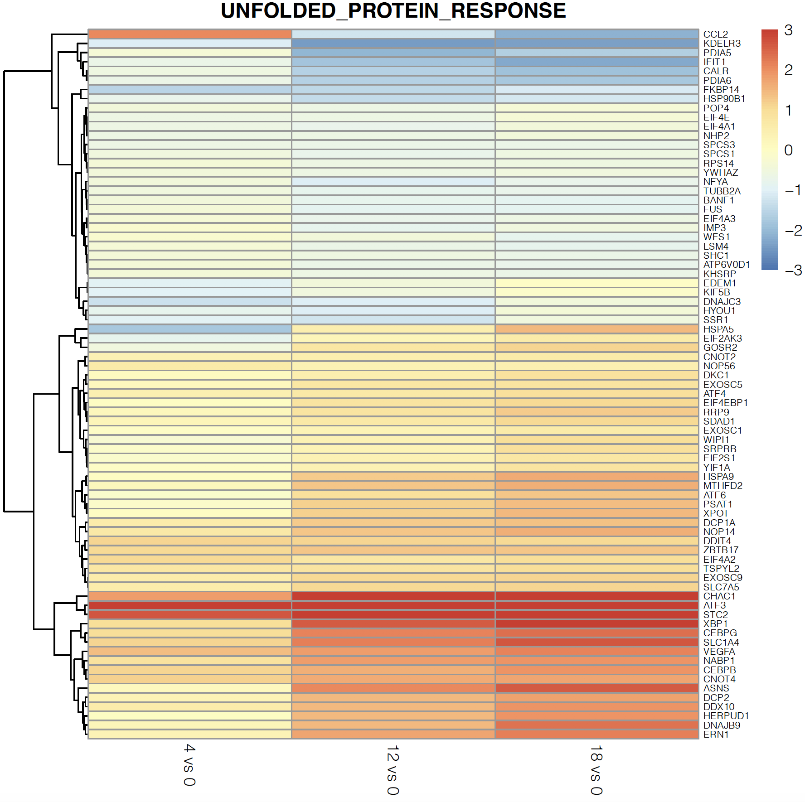
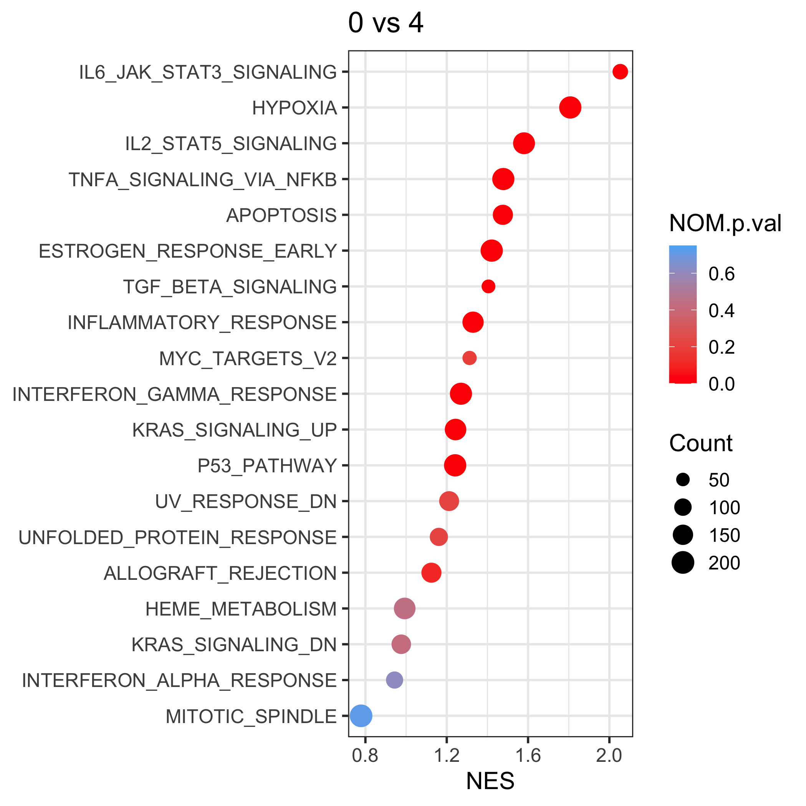
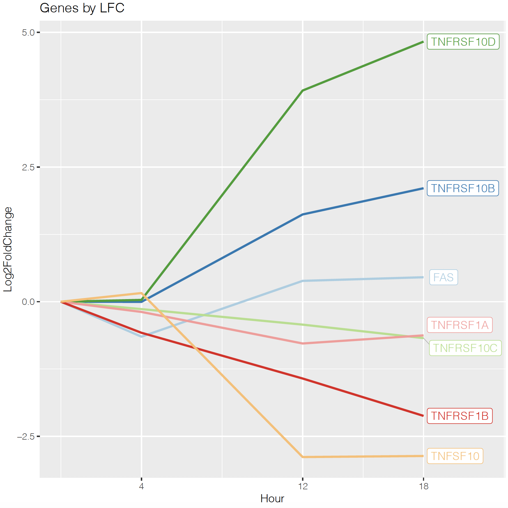

# RNA-seq
RNAseq pipeline and analysis/plotting

This script requires the user to use their own Salmon index, as one is not provided here. The pipeline portion of this script is designed for use on SLURM HPC clusters where certain dependencies can be loaded at runtime. 

full_pipeline_devel.sh uses the Demultiplexing tool from https://github.com/jfjlaros/demultiplex/blob/master/docs/usage.rst, as well as the popular pseudomapping tool Salmon.

tximport.R will take the Salmon quant outputs and transform them into a count matrix, which can save some time and allow the user to skip step 1 of the next script.

deseq2_analysis_and_plotting.R processes the count matrix using Deseq2, a popular rnaseq analysis tool. Plotting is then performed based on experimental requirements.

## Example Plots
The data used in these plots has not been published yet and is not yet publically available. The following are examples for script usage. The data used is from a time course experiment where changes in gene expression and gene ontology are monitored over time

### Heatmap of UPR pathway genes up/downregulated 

### Waterfall plot of top 50 genes sorted by absolute value of log2 fold change

### Bubble plot of GSEA results

### Line graph of selected genes

