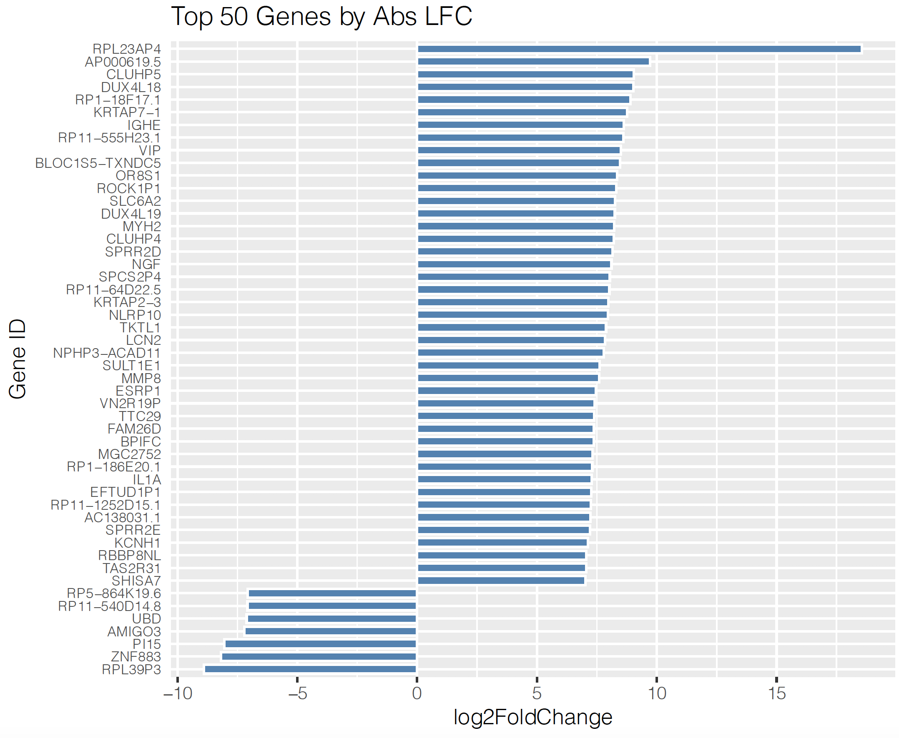

# RNA-seq
RNAseq pipeline and analysis/plotting

This script requires the user to use their own Salmon index, as one is not provided here. The pipeline portion of this script is designed for use on SLURM HPC clusters where certain dependencies can be loaded at runtime. 

## Example Plots
The data used in these plots has not been published yet and is not yet publically available. The following are examples for script usage. 

### Heatmap of inflammatory pathway genes up/downregulated 

### Waterfall plot of top 50 genes sorted by absolute value of log2 fold change

### Bubble plot of GSEA results

![bubbleplot](ExamplePlots/0v4_bubble.png
